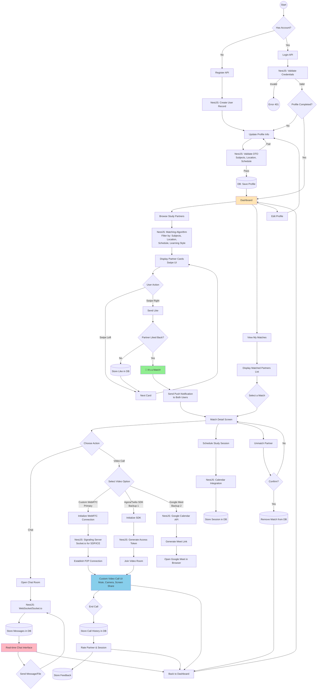
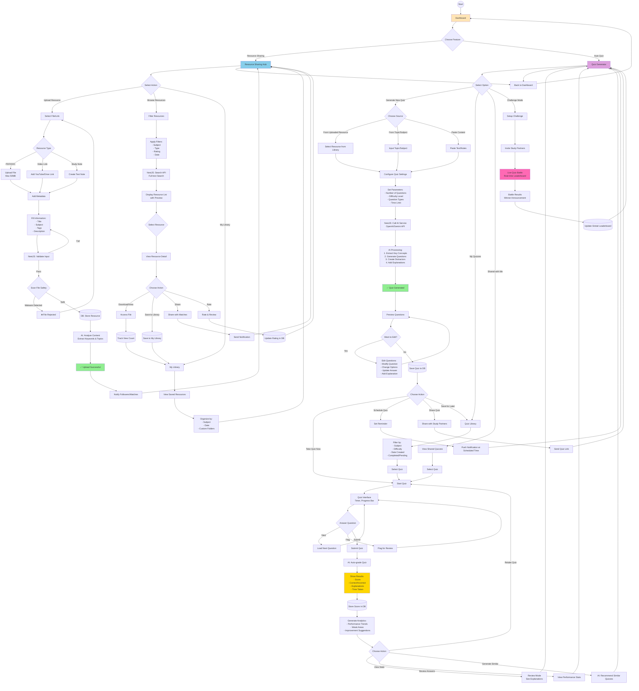
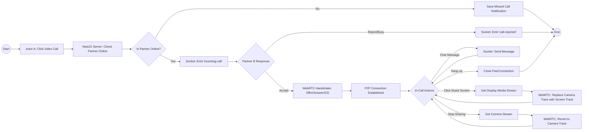

# 🎓 Study Partner Matching Platform (Backend)

> Một nền tảng kết nối người học dựa trên môn học, vị trí, lịch trình và phong cách học tập, tích hợp Chat Real-time và Video Call.


## 📖 Giới thiệu

Dự án này là Backend API được xây dựng bằng **NestJS**, cung cấp logic nghiệp vụ cho ứng dụng tìm bạn học (Study Partner). Hệ thống bao gồm: Authentication, Quản lý Profile, Thuật toán Matching (Vuốt trái/phải), Chat thời gian thực và Video Call đa nền tảng.

## 🧩 Luồng hoạt động (User Flow)

```mermaid
graph LR
    Dashboard((Dashboard)) --> ClickFind[User: Click 'Find Partner']
    
    ClickFind --> InitParams[Initialize Search:\nMin Score = 70\nTarget = 20 candidates]
    
    InitParams --> QueryDB[Query Database:\nFilter by criteria\nCalculate match scores]
    
    QueryDB --> CheckCount{Count >= 20?}
    
    CheckCount -- Yes --> ReturnList[Return Top 20\nSorted by Score]
    
    CheckCount -- No --> CheckMinScore{Min Score > 50?}
    
    CheckMinScore -- Yes --> LowerThreshold[Lower Min Score:\nScore -= 10]
    LowerThreshold --> QueryDB
    
    CheckMinScore -- No --> ReturnAvailable[Return All Available\nSorted by Score]
    
    ReturnList --> ViewProfile[User: View Candidate Profile]
    ReturnAvailable --> ViewProfile
    
    ViewProfile --> SendReq{Send Request?}
    
    SendReq -- No --> ViewProfile
    SendReq -- Yes --> CreateReq[NestJS: Create Request\nStatus: PENDING]
    
    CreateReq --> Notify[Socket: Notify Receiver]
    Notify --> ReceiverAction{Receiver Action}
    
    ReceiverAction -- Reject --> UpdateStatusRej[(DB: Update REJECTED)]
    UpdateStatusRej --> EndFlow((End))
    
    ReceiverAction -- Accept --> UpdateStatusAcc[(DB: Update ACCEPTED)]
    UpdateStatusAcc --> CreateRoom[NestJS: Create Chat Room]
    CreateRoom --> Connected((Connected))
```









## 📂 Cấu trúc dự án (Project Structure)

Dự án áp dụng kiến trúc **Modular** của NestJS:

```plaintext
apps/server
├── src
│   ├── app.module.ts
│   ├── main.ts
│   │
│   ├── common/                  # Các tiện ích chung
│   │   ├── decorators/          # @CurrentUser()
│   │   ├── filters/             # Global Exception Filters
│   │   └── guards/              # AuthGuard (Flow: Login -> AuthGuard)
│   │
│   ├── modules/                 # CHIA THEO FLOW CHART
│   │   │
│   │   ├── auth/                # (Flow: LoginCheck, Register, Login)
│   │   │   ├── auth.controller.ts
│   │   │   ├── auth.service.ts  # Xử lý logic đăng nhập/đăng ký
│   │   │   └── strategies/      # JWT Strategy
│   │   │
│   │   ├── users/               # (Flow: CreateAcc, InputProfile, ValidateDTO)
│   │   │   ├── users.controller.ts
│   │   │   ├── users.service.ts # CRUD Profile
│   │   │   ├── dto/
│   │   │   │   ├── create-user.dto.ts
│   │   │   │   └── update-profile.dto.ts # Validate: Subjects, Location, Schedule
│   │   │   └── entities/        # User Entity
│   │   │
│   │   ├── matching/            # (Flow: BrowsePartners, MatchAlgo, SwipeAction)
│   │   │   ├── matching.controller.ts # API: Get Recommendations, Swipe
│   │   │   ├── matching.service.ts    # Logic: Matching Algorithm (Filter logic)
│   │   │   ├── events/          # Xử lý sự kiện "It's a Match!"
│   │   │   └── entities/        # Like, Match Record
│   │   │
│   │   ├── chat/                # (Flow: OpenChat, WebSocket, StoreDB)
│   │   │   ├── chat.gateway.ts  # WebSocket Gateway (Socket.io)
│   │   │   ├── chat.service.ts  # Lưu/Lấy tin nhắn từ DB
│   │   │   └── entities/        # Message, ChatRoom
│   │   │
│   │   ├── video-call/          # (Flow: Video Call Options)
│   │   │   ├── video-call.controller.ts
│   │   │   ├── gateways/
│   │   │   │   └── signaling.gateway.ts # (Option 1: Custom WebRTC Signaling)
│   │   │   └── strategies/      # Strategy Pattern cho các loại Call
│   │   │       ├── webrtc.strategy.ts   # P2P logic
│   │   │       ├── agora.strategy.ts    # (Option 2: SDK Token Gen)
│   │   │       └── google-meet.strategy.ts # (Option 3: Google Calendar API)
│   │   │
│   │   ├── scheduling/          # (Flow: ScheduleSession, CalendarAPI)
│   │   │   ├── scheduling.service.ts   # Tích hợp Calendar
│   │   │   └── entities/               # StudySession
│   │   │
│   │   └── notifications/       # (Flow: NotifyBoth)
│   │       └── notifications.service.ts # Push Notification (Firebase/OneSignal)
│   │
│   └── database/                # Config kết nối DB
│
├── .env                         # Chứa API Keys (Google, Agora, DB)
└── package.json
```

## 🛠 Tech Stack

*   **Framework:** NestJS (Node.js)
*   **Language:** TypeScript
*   **Database:** PostgreSQL (User/Match) & MongoDB (Message/Logs)
*   **Real-time:** Socket.io
*   **API Docs:** Swagger UI

## 🚀 Cài đặt và Chạy ứng dụng

### 1. Yêu cầu (Prerequisites)
*   Node.js (v16+)
*   Docker (để chạy Database)

### 2. Cài đặt dependencies
```bash
npm install
```

### 3. Cấu hình môi trường (.env)
Tạo file `.env` tại thư mục gốc:
```env
PORT=3000
DB_HOST=localhost
DB_PORT=5432
DB_USERNAME=postgres
DB_PASSWORD=secret
DB_NAME=study_partner
JWT_SECRET=my_super_secret
```

### 4. Chạy ứng dụng
```bash
# Development
npm run start:dev

# Production
npm run build
npm run start:prod
```

## 📚 API Documentation

Truy cập Swagger UI để xem tài liệu API:
👉 **URL:** `http://localhost:3000/api`

## 💡 Chi tiết các Modules chính

1.  **Matching Engine:** Filter user dựa trên `Subjects`, `Location` (GeoSpatial), và `Schedule`.
2.  **Video Call Strategies:** Hỗ trợ Strategy Pattern cho WebRTC (P2P), Agora SDK, hoặc Google Meet.
3.  **Chat:** Sử dụng Socket.io Namespace/Room để quản lý phòng chat riêng tư.

## 📄 License
Distributed under the MIT License.